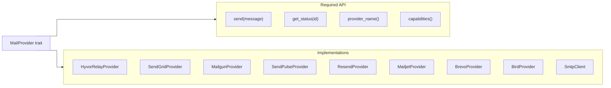
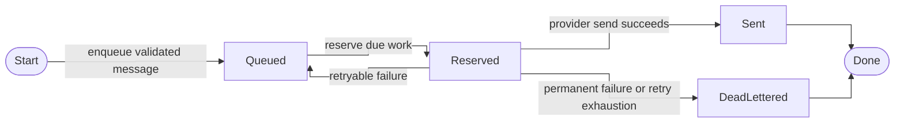

# Architecture And Design

## Purpose

Mailbridge is the email delivery boundary for Rust services. Applications build
and validate one provider-neutral `EmailMessage`, then send immediately or
enqueue for retry through a configured `MailProvider`.

The design goal is to keep product code independent from provider SDKs,
provider-specific request shapes, and delivery infrastructure choices. Provider
integrations, queue backends, telemetry, rate limiting, and TLS choices stay
isolated behind feature flags so applications can enable only the pieces they
need.

## High-Level Flow

```mermaid
%%{init: {"flowchart": {"curve": "stepAfter"}} }%%
flowchart LR
    app[Application] --> client[MailClient]
    client --> checks[Validation and rate limits]
    checks --> mode{Delivery mode}
    mode -->|Immediate| provider[MailProvider]
    mode -->|Queued| queue[MailQueue]
    queue --> worker[QueueWorker]
    worker --> provider

    subgraph providers[Provider Implementations]
        direction TB
        hyvor[Hyvor Relay]
        sendgrid[SendGrid]
        mailgun[Mailgun]
        sendpulse[SendPulse]
        resend[Resend]
        mailjet[Mailjet]
        brevo[Brevo]
        bird[Bird]
        smtp[SMTP]
    end

    provider --> providers
```



## Module Boundaries

```text
src/
  client/       public send/enqueue client and delivery mode
  config/       environment and builder-based configuration
  email/        provider-neutral message, address, and attachment types
  error/        typed errors and retry classification
  provider/     provider trait and provider-specific implementations
  queue/        queue traits, queue item types, workers, and backends
  rate_limit/   global and per-domain local rate limiting
  smtp/         SMTP transport provider
  telemetry/    low-cardinality events safe for logs/traces
```

Each `mod.rs` should contain only module declarations and `pub use`
re-exports. Implementation belongs in sibling files.

## Core Types

### `EmailMessage`

`EmailMessage` is the provider-neutral representation of an outbound message.
It owns validated sender, recipient, subject, body, headers, and attachment
data. Provider modules convert this model into their own request shape.

Design rules:

- reject malformed email addresses before network calls;
- reject header injection;
- require at least one recipient;
- require at least one body part;
- preserve provider-neutral fields even when a provider lacks support.

### `MailProvider`

`MailProvider` is the provider abstraction:

```rust
#[async_trait]
pub trait MailProvider: Send + Sync {
    async fn send(&self, message: &EmailMessage) -> Result<SendReceipt>;
    async fn get_status(&self, id: &MessageId) -> Result<Option<SendStatus>>;
    fn provider_name(&self) -> &'static str;
    fn capabilities(&self) -> ProviderCapabilities;
}
```

The concrete provider implementations use this shape:



Provider implementations own protocol mapping, auth, response parsing, and
provider-specific error normalization.

### `MailClient`

`MailClient` is the application-facing entry point. It combines:

- one provider;
- allowed sender domains;
- delivery mode;
- optional queue;
- optional rate limiter;
- retry settings.

Applications should use `MailClient` instead of invoking providers directly
unless they have a narrow integration reason.

### `MailQueue`

`MailQueue` abstracts deferred delivery. Queue backends implement enqueue,
reserve, retry, mark-sent, and dead-letter operations. The queue worker applies
retry policy and delegates sending back to a provider.

Durable queues are feature-gated because their dependency and operational
profiles differ.

## Feature Flags

Default features target the common HTTP-relay path:

- `hyvor-relay`
- `api`
- `rustls`
- `queue-memory`
- `rate-limit`

Optional features enable SMTP, durable queues, telemetry, dotenv loading, and
additional HTTP providers. TLS backends are mutually exclusive: `rustls` and
`native-tls` must not be enabled together.

HTTP providers use `reqwest` 0.13. Mailbridge's `rustls` feature enables
`reqwest/rustls`; `native-tls` enables `reqwest/native-tls`. Default features
prefer Rustls for a pure-Rust TLS stack.

Durable SQL queue features use SQLx 0.9 with `sqlx/runtime-tokio` and
`sqlx/tls-rustls`. This sets the crate MSRV to Rust 1.94 or newer.

## Provider Design

Provider modules should:

- keep request/response DTOs private unless public exposure is intentional;
- convert from `EmailMessage` using borrowed data where possible;
- map temporary provider failures to retryable `MailError` variants;
- map validation, authorization, and sender-domain failures to permanent
  errors;
- avoid storing or logging secrets outside secret-bearing types;
- include focused unit tests for request serialization and error mapping.

Provider modules should not:

- perform queue policy decisions;
- perform application-level retry loops;
- expose provider SDK types through the main public API;
- log message bodies, attachment content, or full recipient lists.

## Queue Design

The queue abstraction is intentionally small. It supports:



Backend notes:

- `MemoryQueue` is for tests and local development only.
- `SqliteQueue` is for single-node durable queueing.
- `PostgresQueue` is for deployments that already operate PostgreSQL and need
  SQL visibility.
- `ScyllaQueue` is for high-throughput distributed queueing where the
  deployment can own Scylla operations.

## Error Design

`MailError` is the single library error type. It should preserve enough
structure for applications and queue workers to decide whether a failure is
retryable.

Expected classifications:

- validation errors are permanent;
- configuration errors are permanent;
- auth and authorization errors are permanent;
- provider rejections are usually permanent;
- network errors and provider 5xx responses are temporary;
- throttling may be temporary when a provider indicates retry is appropriate.

## Telemetry Design

Telemetry is optional and must be safe by default.

Allowed fields:

- provider name;
- event type;
- retryable classification;
- queue backend;
- counts;
- low-cardinality status labels.

Disallowed fields:

- API keys;
- SMTP passwords;
- OAuth tokens;
- message bodies;
- attachment content;
- full recipient lists;
- private mailbox data.

## Security Design

Secrets are represented with `SecretString`. Secret-bearing config types should
avoid derived debug output that reveals values. Provider implementations should
copy secrets only when required by third-party libraries and should keep those
copies scoped to transport construction.

`.env` is ignored and must remain ignored.

## Extension Points

Near-term extension points:

- stronger generic SMTP configuration;
- mailbox SMTP presets;
- OAuth token-provider abstraction;
- Gmail API provider;
- Microsoft Graph provider;
- additional transactional HTTP providers.

Long-term extension points:

- richer status tracking;
- webhook normalization;
- additional queue backends;
- optional metrics exporters.

## Compatibility Principles

- Keep `EmailMessage`, `MailProvider`, `MailClient`, and `MailError` stable
  across minor releases where practical.
- Add provider-specific features behind opt-in flags.
- Avoid default-feature growth that pulls in heavy or surprising dependencies.
- Keep live tests opt-in and mock external services in normal CI.
